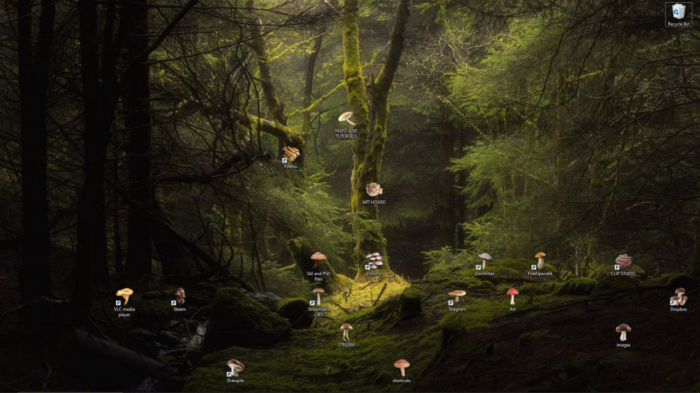
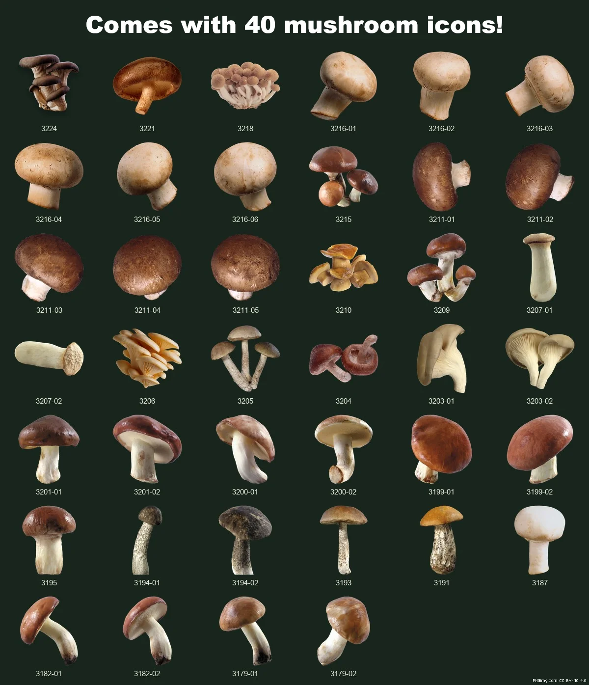

# Mushroomarizer

A silly little tool that makes your desktop folders and shortcuts look like mushrooms

The idea came from this image, but I don't know its original source:

## Roadmap

- [X] Create a basic version of Mushroomarizer
- [X] Add a sufficient number of mushroom icons
- [ ] Add "forest mode": backgrounds with custom positions for icons
- [ ] Add a task for shortcuts auto update?

## Known Issues

- Newly created folders are not affected by Mushroomarizer
