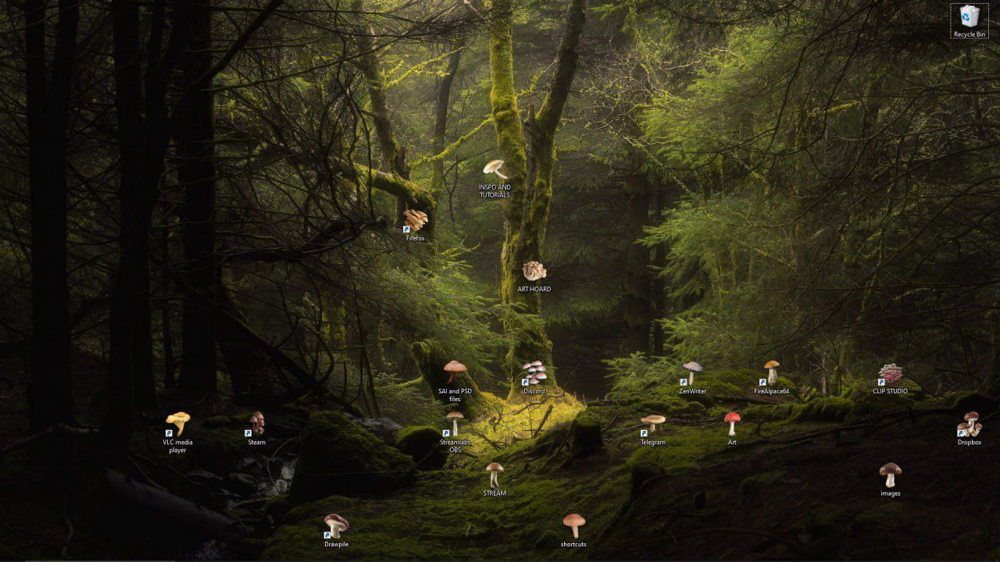

# Mushroomarizer

Silly little tool to make your folders look like mushrooms.

Idea for this came from this meme image, origin of which I don't know.

## Roadmap

- [x] Create a basic version of the mushroomarizer
- [ ] Add a sufficient amount of mushrooms
- [ ] Add forest mode: background and folder positions

## Issues

- [ ] Newly created folders are not affected by the mushroomarizer
